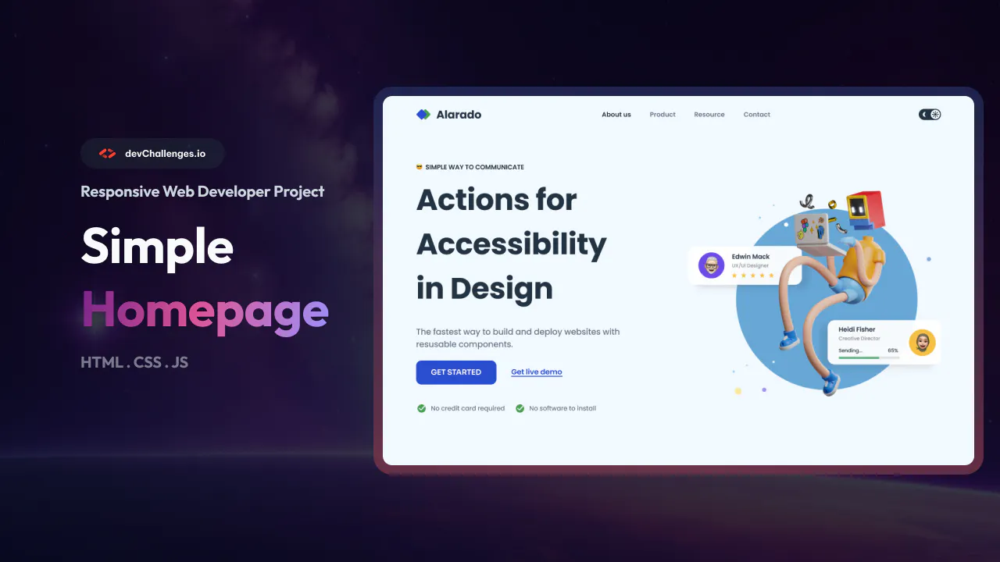

<h1><a href="https://devchallenges.io/challenge/simple-hompage-alarado">Simple Homepage - Alarado</a></h1>

This challenge is a great way to start using JS with HTML and CSS. The challenge is to create a FAQ page that challenges you to use JavaScript to modify basic elements

User stories :
- Create a simple homepage page that matches the given design.

- Use HTML to create the basic structure.

- Add logo, heading, description, links, buttons,.. according to the design.

- User should be able to toggle between light and dark mode (light as default).

- Use CSS or CSS frameworks to style the card.

- The page should be responsive on different screen sizes.

- On mobile, users should be able to toggle side navigation.

